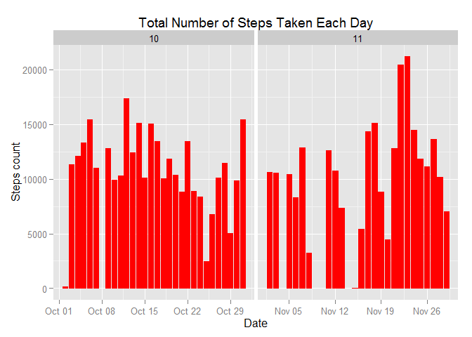
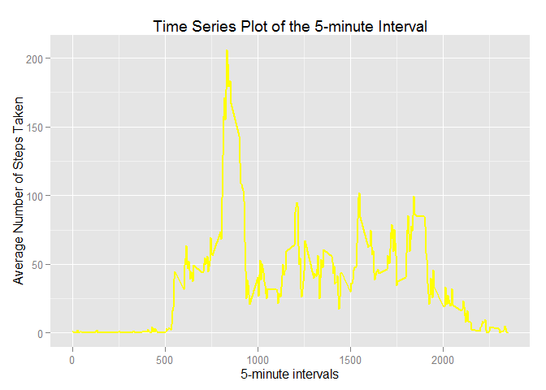
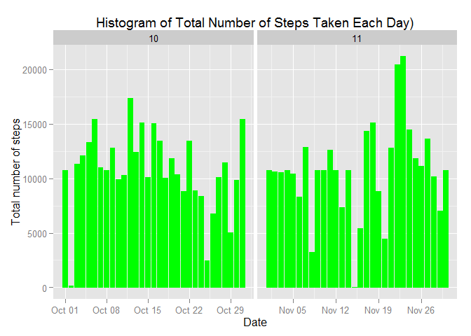

# Reproducible Research: Peer Assessment 1


## Loading and preprocessing the data

```r
library(ggplot2)

unzip("activity.zip")

data <- read.csv("activity.csv", sep = ",", header=TRUE, colClasses=c("integer", "Date", "factor"))

updatedData <- na.omit(data)
```


## What is mean total number of steps taken per day?

```r
stepsPerDay <- aggregate(steps ~ date, updatedData, sum)

head(stepsPerDay)
```

```
##         date steps
## 1 2012-10-02   126
## 2 2012-10-03 11352
## 3 2012-10-04 12116
## 4 2012-10-05 13294
## 5 2012-10-06 15420
## 6 2012-10-07 11015
```
Histogram of the total number of steps taken each day

```r
updatedData$month <- as.numeric(format(updatedData$date, "%m"))

ggplot(updatedData, aes(date, steps)) + geom_bar(stat = "identity", colour = "red", fill = "red", width = 0.8) + facet_grid(. ~ month, scales = "free") + labs(title = "Total Number of Steps Taken Each Day", x = "Date", y = "Steps count")
```

 

Mean of the total number of steps taken per day

```r
mean(stepsPerDay$steps)
```

```
## [1] 10766.19
```
Median of the total number of steps taken per day

```r
median(stepsPerDay$steps)
```

```
## [1] 10765
```


## What is the average daily activity pattern?

```r
stepsByIntervalData <- aggregate(updatedData$steps, list(interval = as.numeric(as.character(updatedData$interval))), FUN = "mean")

names(stepsByIntervalData)[2] <- "StepsByInterval"

ggplot(stepsByIntervalData, aes(interval, StepsByInterval)) + geom_line(color = "yellow", size = 0.8) + labs(title = "Time Series Plot of the 5-minute Interval", x = "5-minute intervals", y = "Average Number of Steps Taken")
```

 

5-minutes interval having maximum number of steps

```r
stepsByIntervalData[stepsByIntervalData$StepsByInterval == max(stepsByIntervalData$StepsByInterval), ]
```

```
##     interval StepsByInterval
## 104      835        206.1698
```
## Imputing missing values

```r
sum(is.na(data))
```

```
## [1] 2304
```

```r
newUpdatedData <- data

newUpdatedData$month <- as.numeric(format(newUpdatedData$date, "%m"))

for (i in 1:nrow(newUpdatedData)) {

  if (is.na(newUpdatedData$steps[i])) {
  
    newUpdatedData$steps[i] <- stepsByIntervalData[which(newUpdatedData$interval[i] == stepsByIntervalData$interval), ]$StepsByInterval
    
    }
}

sum(is.na(newUpdatedData))
```

```
## [1] 0
```


```r
head(newUpdatedData)
```

```
##       steps       date interval month
## 1 1.7169811 2012-10-01        0    10
## 2 0.3396226 2012-10-01        5    10
## 3 0.1320755 2012-10-01       10    10
## 4 0.1509434 2012-10-01       15    10
## 5 0.0754717 2012-10-01       20    10
## 6 2.0943396 2012-10-01       25    10
```

```r
ggplot(newUpdatedData, aes(date, steps)) + geom_bar(stat = "identity",
                                             colour = "green",
                                             fill = "green",
                                             width = 0.8) + facet_grid(. ~ month, scales = "free") + labs(title = "Histogram of Total Number of Steps Taken Each Day)", x = "Date", y = "Total number of steps")
```

 


```r
newstepsPerDay <- aggregate(steps ~ date, newUpdatedData, sum)

newMean <- mean(newstepsPerDay$steps)
newMean
```

```
## [1] 10766.19
```

```r
newMedian <- median(newstepsPerDay$steps)
newMedian
```

```
## [1] 10766.19
```

```r
oldMean <- mean(stepsPerDay$steps)
oldMedian <- median(stepsPerDay$steps)

newMean - oldMean
```

```
## [1] 0
```

```r
newMedian - oldMedian
```

```
## [1] 1.188679
```

## Are there differences in activity patterns between weekdays and weekends?

```r
newUpdatedData$weekdays <- factor(format(newUpdatedData$date, "%A"))

levels(newUpdatedData$weekdays)
```

```
## [1] "Friday"    "Monday"    "Saturday"  "Sunday"    "Thursday"  "Tuesday"  
## [7] "Wednesday"
```

```r
levels(newUpdatedData$weekdays) <- list(weekday = c("Monday", "Tuesday",
                                             "Wednesday", 
                                             "Thursday", "Friday"),
                                 weekend = c("Saturday", "Sunday"))
levels(newUpdatedData$weekdays)
```

```
## [1] "weekday" "weekend"
```

```r
table(newUpdatedData$weekdays)
```

```
## 
## weekday weekend 
##   12960    4608
```


```r
avgStepsByInterval <- aggregate(newUpdatedData$steps, 
                      list(interval = as.numeric(as.character(newUpdatedData$interval)), 
                           weekdays = newUpdatedData$weekdays), FUN = "mean")

names(avgStepsByInterval)[3] <- "meanOfSteps"

library(lattice)

xyplot(avgStepsByInterval$meanOfSteps ~ avgStepsByInterval$interval | avgStepsByInterval$weekdays, layout = c(1, 2), type = "l", xlab = "Interval", ylab = "Number of steps")
```

 
